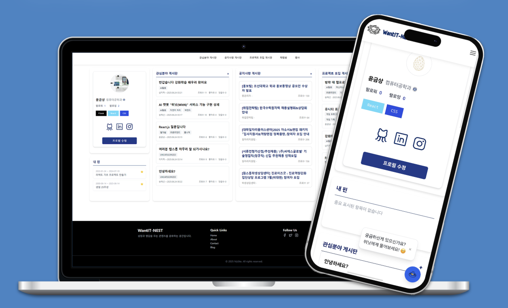

# Jihyuk Lee - Portfolio

This is a responsive portfolio website created by Jihyuk Lee. It showcases personal information, skills, projects, and contact details in a clean and modern design.

This project was developed as part of the **2025 WFK ICT Volunteers - Daffodil International University** program.

## 🌐 Live Demo

You can view the live website here: [https://potatodevel0per.github.io/portfolio_website/](https://potatodevel0per.github.io/portfolio_website/)

## ✨ Features

- **Header & About:** Introduces Jihyuk Lee with a profile picture and a brief summary.
- **Education:** Displays educational background.
- **Skills:** Lists technical skills with icons.
- **Certificates:** Shows a list of acquired certificates.
- **History:** A timeline of activities and experiences.
- **Projects:** Showcases a featured project with a description and image.
- **Contact:** Provides links to email and social media profiles (GitHub, Instagram).
- **Responsive Design:** The layout adapts to different screen sizes for optimal viewing on mobile and desktop devices.

## 🛠️ Tech Stack

- **HTML5**
- **CSS3** (with Flexbox and Grid)
- **JavaScript**
- **Font Awesome** (for icons)

## 🚀 How to Use

1.  Clone the repository:
    ```bash
    git clone https://github.com/PotatoDevel0per/Portfolio.git
    ```
2.  Open `index.html` in your web browser.

## 📸 Screenshots

*(You can add screenshots of your portfolio website here)*


